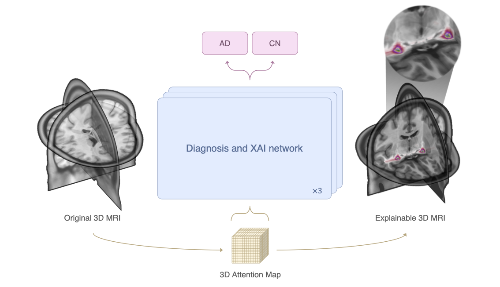
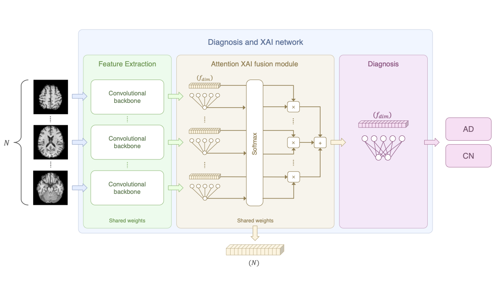
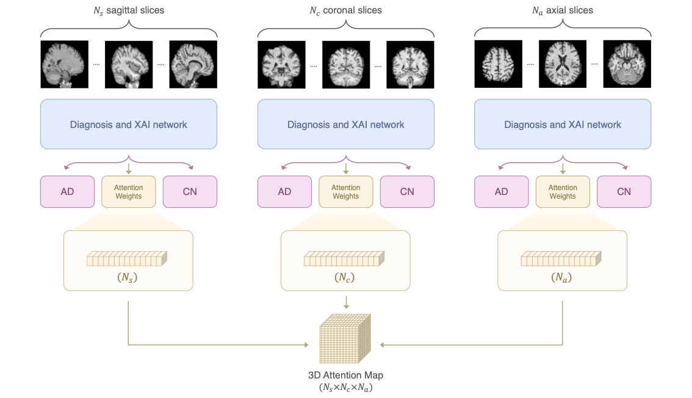
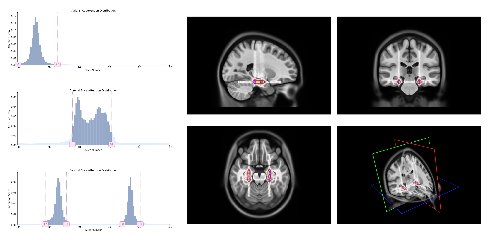
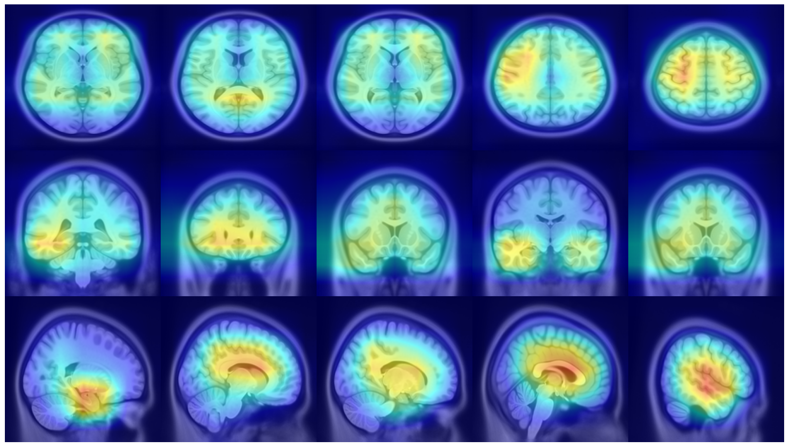
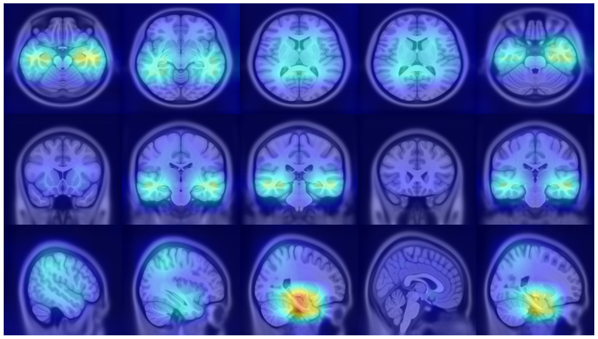
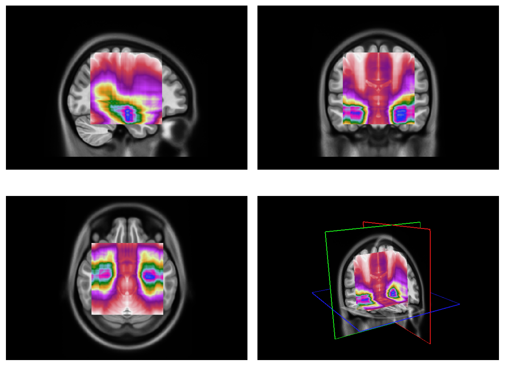
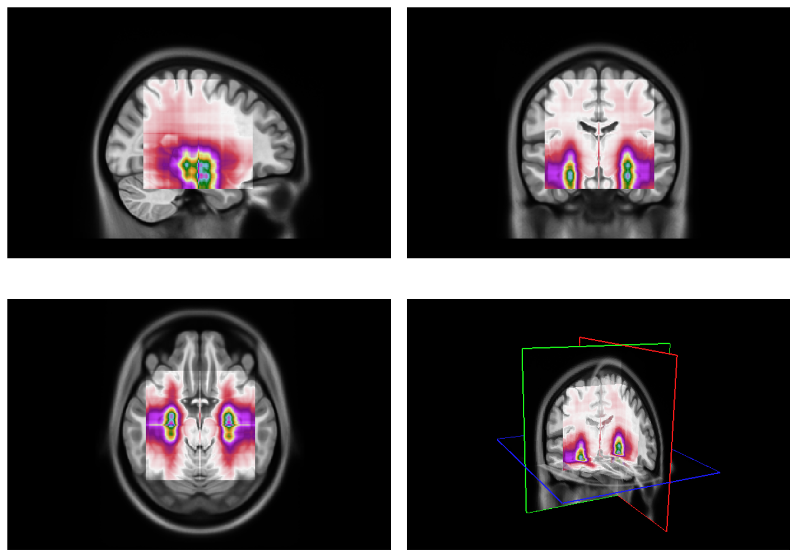

# [AXIAL] 
This is the original code implementation of the *AXIAL framework* proposed in the manuscript "**AXIAL: Attention-based eXplainability for Interpretable Alzheimer's Localized Diagnosis using 2D CNNs on 3D MRI brain scans**" by Gabriele Lozupone. [[Paper]](https://arxiv.org/abs/2407.02418v1)

## Abstract

This study presents an innovative method for Alzheimer's disease diagnosis using 3D MRI designed to enhance the explainability of model decisions. Our approach adopts a soft attention mechanism, enabling 2D CNNs to extract volumetric representations. At the same time, the importance of each slice in decision-making is learned, allowing the generation of a voxel-level attention map to produces an explainable MRI. To test our method and ensure the reproducibility of our results, we chose a standardized collection of MRI data from the Alzheimer's Disease Neuroimaging Initiative (ADNI). On this dataset, our method significantly outperforms state-of-the-art methods in (i) distinguishing AD from cognitive normal (CN) with an accuracy of 0.856 and Matthew's correlation coefficient (MCC) of 0.712, representing improvements of 2.4% and 5.3% respectively over the second-best, and (ii) in the prognostic task of discerning stable from progressive mild cognitive impairment (MCI) with an accuracy of 0.725 and MCC of 0.443, showing improvements of 10.2% and 20.5% respectively over the second-best. We achieved this prognostic result by adopting a double transfer learning strategy, which enhanced sensitivity to morphological changes and facilitated early-stage AD detection. With voxel-level precision, our method identified which specific areas are being paid attention to, identifying these predominant brain regions: the *hippocampus*, the *amygdala*, the *parahippocampal*, and the *inferior lateral ventricles*. All these areas are clinically associated with AD development. Furthermore, our approach consistently found the same AD-related areas across different cross-validation folds, proving its robustness and precision in highlighting areas that align closely with known pathological markers of the disease.



## Framework overview

This repository contains code for preprocessing structural Magnetic Resonance Imaging (sMRI) data from the Alzheimer's
Disease Neuroimaging Initiative (ADNI) dataset. The code converts the ADNI dataset into the Brain Imaging Data
Structure (BIDS) format and applies preprocessing algorithms, including N4 bias field correction, MNI152 registration,
and brain extraction. The data preparation is performed using the Clinica software.

Additionally, this repository provides the necessary code to train, validate, and test various deep learning models
using PyTorch. Furthermore, the repository includes two explainability approaches one based on GradCAM and the other
based on the attention mechanism.

1. **3D Models:** These approaches utilizes a 2D backbone to extract feature maps from slices and attention mechanisms to enables capturing
   slice-level features and their spatial relationships.

2. **2D Models:** This approach directly classifies each slice by attaching a classifier to the backbone. The final label
   for the entire image is determined using a majority voting approach based on the slice predictions.

3. **Explainability:** The first explainability approach proposed generates attention activation maps at the voxel level, highlighting
   the brain regions that are most important for the model's decision-making process. The second approach utilizes GradCAM
   to generate 3D heatmap. The 3D maps are then used to produce XAI metrics that helps to identify the most important brain
   regions for the model's decision-making process.

The repository aims to provide a comprehensive framework for sMRI preprocessing and deep learning analysis, enabling
researchers to efficiently analyze ADNI data and develop advanced models for Alzheimer's disease detection and
classification.

## Table of Contents

1. [Installation](#installation)
2. [Data Preparation](#data-preparation)
    - [ADNI Data Download](#adni-data-download)
    - [Clinical Data Download](#clinical-data-download)
    - [Rename CSV Files](#rename-csv-files)
    - [Install Clinica Software](#install-clinica-software)
    - [Convert ADNI to BIDS](#convert-adni-to-bids)
3. [Preprocessing](#preprocessing)
    - [Run Preprocessing Pipeline](#run-preprocessing-pipeline)
4. [Deep Learning approaches](#deep-learning-approaches)
    - [Diagnosis Network proposed in the paper (Axial3D)](#diagnosis-network-proposed-in-the-paper-Axial3D)
    - [Training and test a model with 5-fold cross-validation](#training-and-test-a-model-with-5-fold-cross-validation)
    - [Attention-based Explainability](#attention-based-explainability)
    - [GradCAM-based Explainability](#gradcam-based-explainability)
5. [Acknowledgement](#acknowledgement)
6. [License](#license)

## Installation

To use the code in this repository, follow these steps:

1. Clone the repository:

```bash
git clone https://github.com/GabrieleLozupone/AXIAL.git
```

2. Install the required dependencies:

```bash
pip install -r requirements.txt
```

## Data Preparation

Before performing preprocessing on the ADNI dataset, follow the steps below to prepare the necessary data.

### ADNI Data Download

1. Subscribe to the ADNI website at [https://ida.loni.usc.edu/login.jsp](https://ida.loni.usc.edu/login.jsp).

2. Download the desired ADNI image collection. In the case of this work, the image collection name is "ADNI1 Complete
   1Yr 1.5T".

### Clinical Data Download

1. On the ADNI website, click on "Download" and then select "Study Data".

2. Choose "ALL" to download all available data.

3. In the "Tabular Data (CSV format)" section, select all the files and download them.

### Rename CSV Files

Some CSV files in the clinical data may have a date at the end of their name. Remove the date from the file names to
ensure compatibility with the preprocessing pipeline.

### Install Clinica Software

Install the Clinica software by following the instructions provided
at [https://aramislab.paris.inria.fr/clinica/docs/public/latest/Converters/ADNI2BIDS/](https://aramislab.paris.inria.fr/clinica/docs/public/latest/Converters/ADNI2BIDS/).
Clinica is a powerful tool that facilitates
the conversion of ADNI data to the BIDS structure.

### Convert ADNI to BIDS

To convert the ADNI data to the BIDS structure, use the following command:

```bash
clinica convert adni-to-bids -m T1 DATASET_DIRECTORY CLINICAL_DATA_DIRECTORY BIDS_DIRECTORY
```

Replace `DATASET_DIRECTORY` with the path to the downloaded ADNI dataset, `CLINICAL_DATA_DIRECTORY` with the path to the
downloaded clinical data, and `BIDS_DIRECTORY` with the desired output path for the BIDS-formatted dataset. The `-m T1`
option specifies that only MRI data with T1 weighting should be converted.

## Preprocessing

This section describes the preprocessing steps for the sMRI data.

### Run Preprocessing Pipeline

To run the preprocessing pipeline on the sMRI data, execute the following command:

```bash
python data_preprocessing.py --bids_path /path/to/bids-dataset --n_proc 10 --checkpoint checkpoint.txt
```

Replace `/path/to/bids-dataset` with the path to the BIDS-formatted dataset obtained from the data preparation steps.
The preprocessing pipeline includes MNI152 registration, brain extraction, and bias field correction with the N4
algorithm. The preprocessed images will be stored in the same path as the original images.

The `n_proc` argument specifies the number of processes to be used for the preprocessing pipeline.

The `checkpoint`argument specifies the path to the checkpoint file, which is used to keep track of the images that have
already been preprocessed. This allows the preprocessing pipeline to be interrupted and resumed later.

Please note that the preprocessing step is time-consuming and may take a significant amount of time to complete. A
checkpoint mechanism is implemented to allow the preprocessing step to be interrupted and resumed later.

This script create a `dataset.csv` file in the BIDS directory, which contains the path to the preprocessed images and
their corresponding labels. This file is used by the deep learning models to load the data.

This script also creates a `dataset_conversion{num_months}.csv` file which contains the path to the preprocessed images
and the corresponding label for progression task (sMCI, pMCI). 

## Deep Learning approaches
### Diagnosis Network proposed in the paper (Axial3D)



### Training and test a model with 5-fold cross-validation

To train a model, run the `train.py` script. The configuration file used must is a YAML file: [config.yaml](config.yaml).

```bash
python train.py
```

The script produces a results that is the average of the 5-fold cross-validation. The table below shows the results obtained on `ADNI1 Complete 1Yr 1.5T` by the proposed model and the other models that can be tested with the framework.

<table style="width: 100%">
  <thead>
    <tr>
      <th rowspan="2">Networks</th>
      <th colspan="4">AD vs. CN</th>
      <th colspan="4">sMCI vs. pMCI</th>
    </tr>
    <tr>
      <th>ACC</th>
      <th>SPE</th>
      <th>SEN</th>
      <th>MCC</th>
      <th>ACC</th>
      <th>SPE</th>
      <th>SEN</th>
      <th>MCC</th>
    </tr>
  </thead>
  <tbody>
    <tr>
      <td>Majority Voting (2D)(VGG16)</td>
      <td>0.804</td>
      <td>0.897</td>
      <td>0.688</td>
      <td>0.605</td>
      <td>0.614</td>
      <td>0.601</td>
      <td><u>0.629</u></td>
      <td>0.229</td>
    </tr>
    <tr>
      <td>Attention Transformer (TransformerConv3D)(VGG16)</td>
      <td>0.826</td>
      <td><b>0.914</b></td>
      <td>0.717</td>
      <td>0.651</td>
      <td><u>0.623</u></td>
      <td>0.665</td>
      <td>0.4873</td>
      <td><u>0.238</u></td>
    </tr>
    <tr>
      <td>AwareNet Diagnosis (AwareNet)(3D)</td>
      <td>0.832</td>
      <td>0.875</td>
      <td>0.778</td>
      <td>0.659</td>
      <td>0.4841</td>
      <td><b>0.774</b></td>
      <td>0.258</td>
      <td>0.039</td>
    </tr>
    <tr>
      <td>Ours (Axial3D)(VGG16)</td>
      <td><b>0.856</b></td>
      <td><u>0.910</u></td>
      <td><u>0.792</u></td>
      <td><b>0.712</b></td>
      <td><b>0.725</b></td>
      <td><u>0.763</u></td>
      <td><b>0.678</b></td>
      <td><b>0.443</b></td>
    </tr>
    <tr>
      <td>Attention-Guided Majority Voting (2D)(VGG16)</td>
      <td><u>0.843</u></td>
      <td>0.894</td>
      <td>0.780</td>
      <td><u>0.683</u></td>
      <td>0.633</td>
      <td>0.624</td>
      <td>0.643</td>
      <td>0.266</td>
    </tr>
    <tr>
      <td>Majority Voting 3D (3D)(VGG16)</td>
      <td>0.836</td>
      <td>0.867</td>
      <td><b>0.797</b></td>
      <td>0.667</td>
      <td>0.629</td>
      <td>0.653</td>
      <td>0.601</td>
      <td>0.254</td>
    </tr>
  </tbody>
</table>


> **Note**: The data splitting is performed by subjects to avoid data leakage problems. Make sure to adjust the
> configuration files according to your specific paths and requirements.

## Attention-based Explainability
### Attention XAI approach proposed in the paper with Axial3D



The `attention_xai_analysis.py` file generates distributions of attention weights for the three planes (axial, coronal, sagittal) starting from three different models that output attention weights slice distribution and produces a result on 5-fold cross-validation to validate consistency. It also produces an explainable MRI on top of the template image MRI. This explainable image is used to produce XAI metrics that help identify which regions are more important for discerning an AD patient from a healthy one.

To run the explainability analysis, execute the following command:
```bash
python attention_xai_analysis.py
```

Results:



<table style="width: 100%">
  <tr>
    <th>Brain Region</th>
    <th>𝑉<sub>𝑟</sub></th>
    <th>𝜇<sub>𝑟</sub></th>
    <th>𝜎<sub>𝑟</sub></th>
    <th>𝐴<sub>𝑚𝑎𝑥,𝑟</sub></th>
    <th>𝐴<sub>𝑚𝑖𝑛,𝑟</sub></th>
    <th>𝑃<sub>𝑟</sub></th>
  </tr>
  <tr>
    <td>Hippocampus left</td>
    <td>1562</td>
    <td>0.136</td>
    <td>0.139</td>
    <td>0.762</td>
    <td>0.028</td>
    <td>0.333</td>
  </tr>
  <tr>
    <td>Hippocampus right</td>
    <td>1426</td>
    <td>0.126</td>
    <td>0.133</td>
    <td>0.783</td>
    <td>0.028</td>
    <td>0.304</td>
  </tr>
  <tr>
    <td>Parahippocampal left</td>
    <td>688</td>
    <td>0.129</td>
    <td>0.137</td>
    <td>0.884</td>
    <td>0.028</td>
    <td>0.254</td>
  </tr>
  <tr>
    <td>Parahippocampal right</td>
    <td>534</td>
    <td>0.129</td>
    <td>0.148</td>
    <td>1.000</td>
    <td>0.028</td>
    <td>0.197</td>
  </tr>
  <tr>
    <td>Amygdala left</td>
    <td>480</td>
    <td>0.097</td>
    <td>0.092</td>
    <td>0.620</td>
    <td>0.028</td>
    <td>0.291</td>
  </tr>
  <tr>
    <td>Amygdala right</td>
    <td>427</td>
    <td>0.095</td>
    <td>0.087</td>
    <td>0.569</td>
    <td>0.028</td>
    <td>0.259</td>
  </tr>
  <tr>
    <td>Inferior Lateral Ventricle right</td>
    <td>232</td>
    <td>0.113</td>
    <td>0.129</td>
    <td>0.677</td>
    <td>0.028</td>
    <td>0.219</td>
  </tr>
  <tr>
    <td>Inferior Lateral Ventricle left</td>
    <td>212</td>
    <td>0.106</td>
    <td>0.105</td>
    <td>0.589</td>
    <td>0.028</td>
    <td>0.200</td>
  </tr>
  <tr>
    <td>Cerebellum Gray Matter left</td>
    <td>208</td>
    <td>0.035</td>
    <td>0.005</td>
    <td>0.052</td>
    <td>0.028</td>
    <td>0.003</td>
  </tr>
  <tr>
    <td>Lateral Orbitofrontal left</td>
    <td>194</td>
    <td>0.033</td>
    <td>0.004</td>
    <td>0.045</td>
    <td>0.028</td>
    <td>0.013</td>
  </tr>
  <tr>
    <td>Fusiform right</td>
    <td>184</td>
    <td>0.045</td>
    <td>0.015</td>
    <td>0.107</td>
    <td>0.028</td>
    <td>0.014</td>
  </tr>
  <tr>
    <td>Lateral Orbitofrontal right</td>
    <td>140</td>
    <td>0.034</td>
    <td>0.004</td>
    <td>0.046</td>
    <td>0.028</td>
    <td>0.009</td>
  </tr>
  <tr>
    <td>Cerebellum Gray Matter right</td>
    <td>119</td>
    <td>0.034</td>
    <td>0.005</td>
    <td>0.054</td>
    <td>0.028</td>
    <td>0.002</td>
  </tr>
  <tr>
    <td>Fusiform left</td>
    <td>88</td>
    <td>0.040</td>
    <td>0.010</td>
    <td>0.070</td>
    <td>0.028</td>
    <td>0.007</td>
  </tr>
  <tr>
    <td>Entorhinal left</td>
    <td>16</td>
    <td>0.034</td>
    <td>0.003</td>
    <td>0.041</td>
    <td>0.030</td>
    <td>0.005</td>
  </tr>
  <tr>
    <td>Ventral Diencephalon left</td>
    <td>6</td>
    <td>0.029</td>
    <td>0.001</td>
    <td>0.031</td>
    <td>0.028</td>
    <td>0.001</td>
  </tr>
  <tr>
    <td>Entorhinal right</td>
    <td>2</td>
    <td>0.033</td>
    <td>0.003</td>
    <td>0.036</td>
    <td>0.031</td>
    <td>0.001</td>
  </tr>
</table>

## GradCAM-based Explainability
The `cam_xai_analysis.py` file performs similar tasks using CAM maps produced with GradCAM-like methods. 

To run the explainability analysis, execute the following command:
```bash
python cam_xai_analysis.py
```

Results:
<table style="width: 100%">
  <tr>
    <td>
      
    </td>
    <td>
      
    </td>
  </tr>
  <tr>
    <td>
      
    </td>
    <td>
      
    </td>
  </tr>
  <tr>
    <td style="text-align: center;">
      <em>Visualization of mean 3D GradCAM++ map of entire dataset overlapped to MNI152 template with <strong>Axial3D (VGG16)</strong></em>
    </td>
    <td style="text-align: center;">
      <em>Visualization of mean 3D GradCAM++ map of entire dataset overlapped to MNI152 template with <strong>TransformerConv3D (VGG16)</strong></em>
    </td>
  </tr>
</table>

## Acknowledgement

- We gratefully thank the **ADNI** investigators for providing access to the data.
- We gratefully thank the **Clinica** developers for providing the software to convert ADNI data to BIDS format.
- We gratefully thank authors of the **AwareNet** model for providing the implementation of the model [AwareNet repository](https://github.com/thibault-wch/Joint-Learning-for-Alzheimer-disease.git). Their paper can be found here [[Joint learning Framework of cross-modal synthesis and diagnosis for Alzheimer's disease by mining underlying shared modality information]](https://doi.org/10.1016/j.media.2023.103032).

## License

This project is licensed. Please review the [License](LICENSE) file for more information.

## Citation
If you find this work useful for your research, please 🌟 our project and cite [our paper](https://) :

```
@misc{lozupone2024axialattentionbasedexplainabilityinterpretable,
      title={AXIAL: Attention-based eXplainability for Interpretable Alzheimer's Localized Diagnosis using 2D CNNs on 3D MRI brain scans}, 
      author={Gabriele Lozupone and Alessandro Bria and Francesco Fontanella and Claudio De Stefano},
      year={2024},
      eprint={2407.02418},
      archivePrefix={arXiv},
      primaryClass={eess.IV},
      url={https://arxiv.org/abs/2407.02418}, 
}
```
